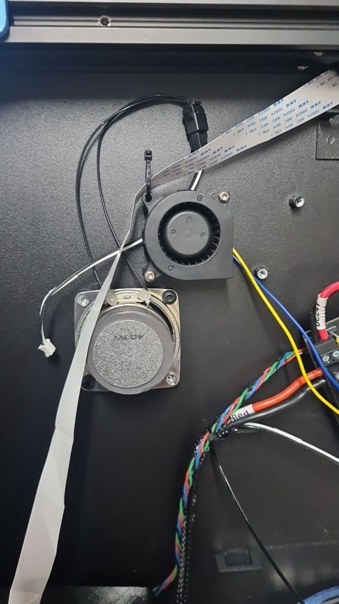

# CaseFan

There's a small fan attached to the main board.  
This can be configured under Klipper to manage the enclosure temperature

There's also a small speaker nearby, probably from the original wiring.  
Although this isn't used at the moment.
