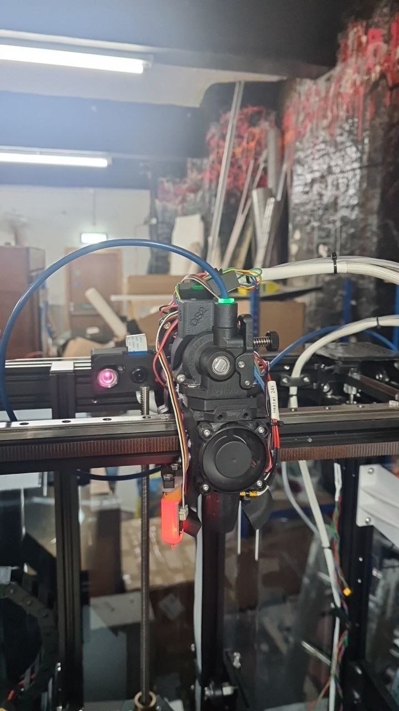
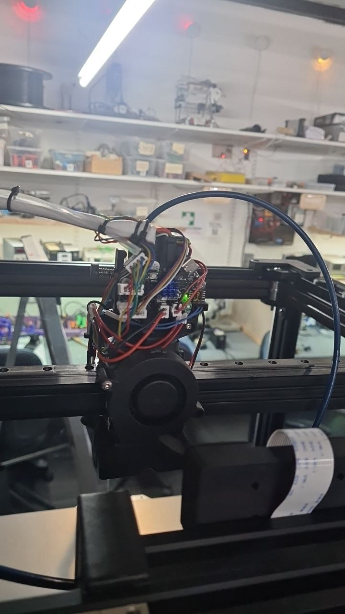

# Head

The head appears to be controlled via CAN Bus

  * Extruder - LDO Orbiter
    https://www.3djake.uk/ldo-motors/orbiter-extruder-v25
  * Hotend - Phaetus Rapido
    https://github.com/Phaetus/Rapido
  * Controller - BigTreeTech EBB36 v1.2
    https://os.ratrig.com/docs/toolboards/btt/ebb-36-12
  * BLTouch
    https://www.antclabs.com/bltouch
  * Filament Sensor
    https://www.3djake.uk/ldo-motors/smart-filament-sensor-1
    https://github.com/RobertLorincz/Orbiter-2-Smart-Sensor
    https://www.orbiterprojects.com/smart-sensor-for-orbiter-v2

## HotEnd

I'm not sure what hotend mount is currently being used it must be compatible with the Ender6
and allow for a Rapido / EBB36 / BLTouch / LDO Orbiter

There is a filament sensor mounted to the top of the LDO Orbiter
I think this is using pins PB5, PB6 on the EBB36

