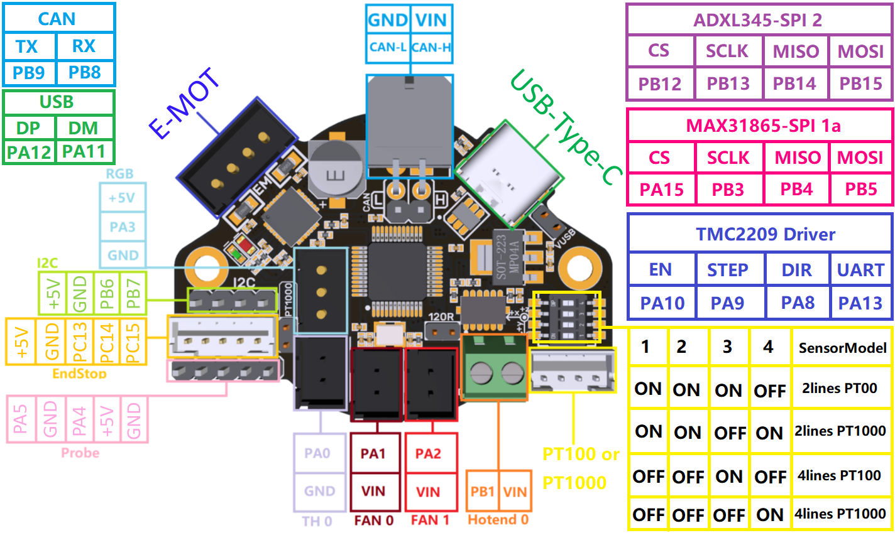

# Head

The head appears to be controlled via CAN Bus

  * Extruder - LDO Orbiter
    https://www.3djake.uk/ldo-motors/orbiter-extruder-v25
  * Hotend - Phaetus Rapido
    https://github.com/Phaetus/Rapido
  * Controller - BigTreeTech EBB36 v1.2
    https://os.ratrig.com/docs/toolboards/btt/ebb-36-12
  * BLTouch
    https://www.antclabs.com/bltouch

## HotEnd

I'm not sure what hotend mount is currently being used it must be compatible with the Ender6
and allow for a Rapido / EBB36 / BLTouch

TODO the i2C pins on the board are also being used for something?
LIMIT_1=PB7,LIMIT_2=PB5,LIMIT_3=PB6

