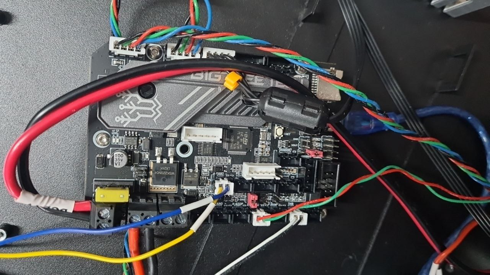
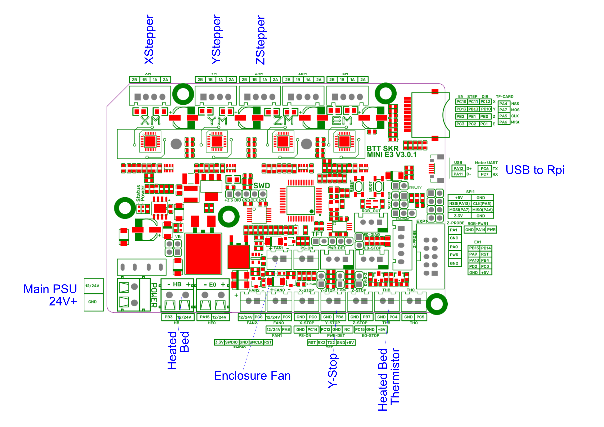
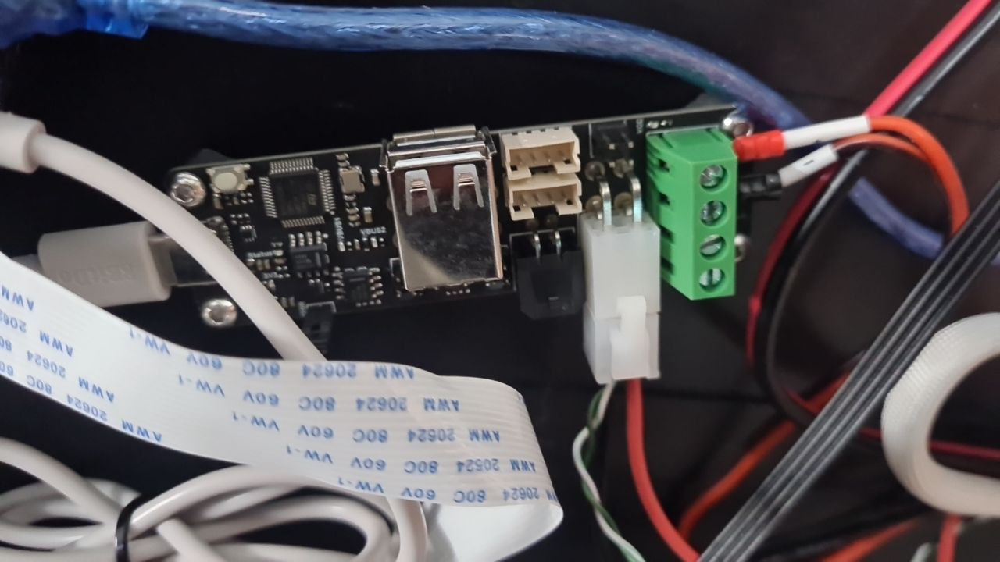

# MainBoard

## Main Control Board

THe Main control board is a BigTreeTech - BTT SKR Mini E3 V3.0  
Note this isn't controlling the hotend

  * https://github.com/bigtreetech/BIGTREETECH-SKR-mini-E3

```
Bus 001 Device 004: ID 1d50:614e OpenMoko, Inc. stm32g0b1xx
```





## USB to CAN adapter

The main head is first controlled via a Big Treetech U2C V2.1
This appears to be a USB to Can Bus adapter

```
Bus 001 Device 005: ID 1d50:606f OpenMoko, Inc. Geschwister Schneider CAN adapter
```

  * https://www.onetwo3d.co.uk/product/bigtreetech-u2c-v2-1-3-can-output
  * https://github.com/bigtreetech/candleLight_fw/tree/stm32g0_support
  * https://github.com/bigtreetech/U2C



We shouldn't need to update this directly as it just presents itself as a Can Adapter within the Rpi  
This provides 2 data line out (CAN+ / CAN-) and 2 lines for the 24V Output as well
