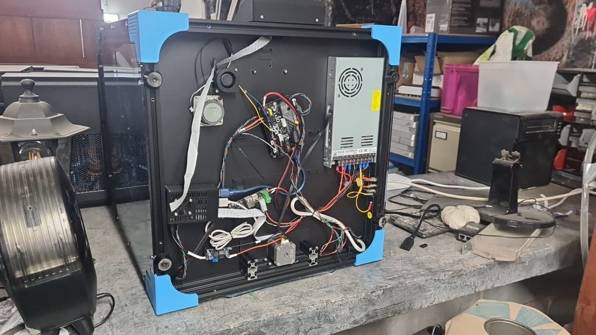

# Overview

The printer is a Ender6 however it's been modified for use with klipper

  * It's using a Rpi3
  * It's using a BTT SKR Mini E3 V3.0  
  * Hotend Rapido / LDO Orbiter
  * All the parts on the bottom are attached via magnets

## Underneath

